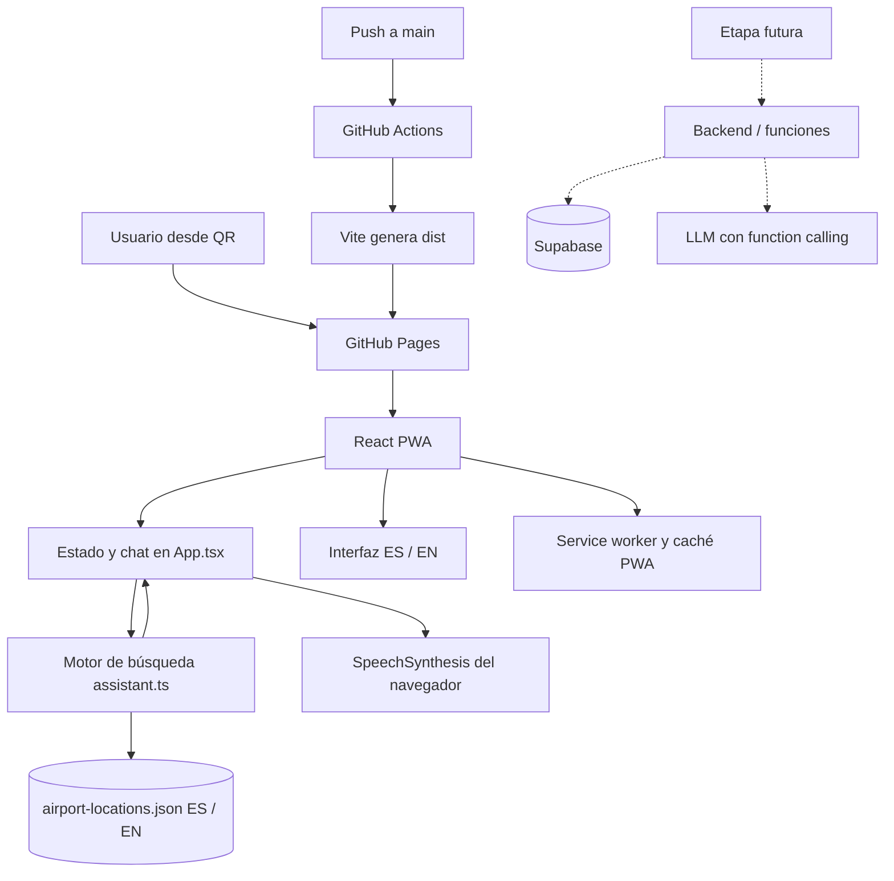
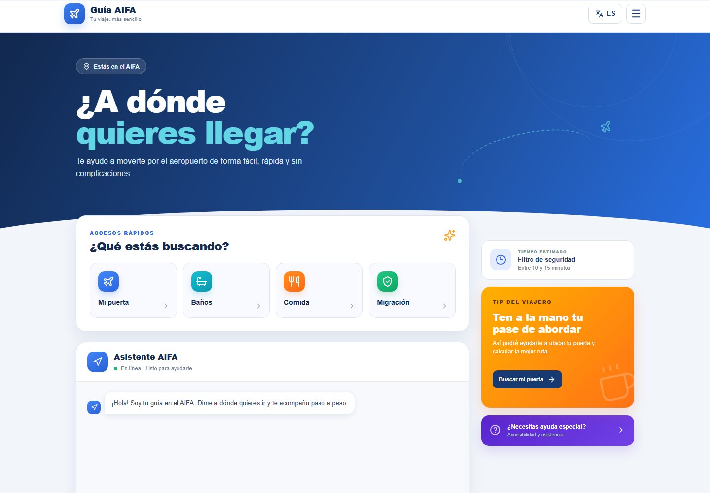
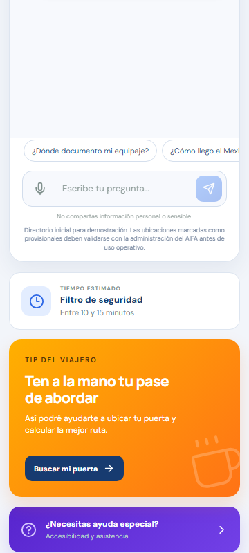

# Guía AIFA

Asistente digital de orientación para el Aeropuerto Internacional Felipe Ángeles. La experiencia está diseñada como PWA para que los viajeros puedan abrirla al escanear un código QR y consultar puertas, baños, restaurantes, migración, transporte y otros servicios.

## Desarrollo

```bash
npm install
npm run dev
```

Para generar la versión de producción:

```bash
npm run build
npm run preview
```

## Stack actual

- React 19 y TypeScript para la interfaz y la lógica del asistente.
- Vite 8 para desarrollo y compilación.
- Lucide React para iconografía.
- `vite-plugin-pwa` para manifest, caché y service worker.
- GitHub Actions y GitHub Pages para despliegue estático.
- JSON local como fuente de datos inicial.

Actualmente no existe un backend, una API propia, autenticación ni una base de datos real.

## Arquitectura



## Datos del aeropuerto

El directorio está en `src/data/airport-locations.json`. Cada registro contiene:

- Categoría y nombre.
- Zona y piso.
- Descripción para llegar.
- Palabras clave para búsquedas flexibles.
- Estado `verified` o `provisional`.
- Campos equivalentes en inglés: `name_en`, `zone_en`, `floor_en`, `description_en` y `keywords_en`.

Los registros iniciales están marcados como provisionales y deben validarse con la administración del AIFA antes de usarse como orientación operativa.

`src/services/assistant.ts` normaliza las preguntas, reconoce categorías y palabras clave, puntúa las ubicaciones y construye la respuesta. Los botones y el campo libre usan el mismo motor.

## Estado actual

- Interfaz adaptable a teléfonos, tabletas y escritorio.
- Accesos rápidos para consultas comunes.
- Chat interactivo que consulta un directorio JSON local.
- Chat flotante adaptable que se abre desde un botón de acceso persistente.
- Búsqueda flexible bilingüe por servicio, aerolínea, zona y palabras clave.
- Interfaz completa en español e inglés.
- Lectura de respuestas mediante la API nativa `SpeechSynthesis`.
- Menú lateral, sugerencias y estados de conversación.
- Manifest y service worker para instalación como PWA.

## Comparación visual

| Antes | Después |
| --- | --- |
|  |  |
|  |  |

El panel móvil abierto se documenta en [esta captura](docs/visual-comparison/after-mobile-chat.png). También se verificó el [estado con viewport reducido por teclado](docs/visual-comparison/after-mobile-keyboard.png).

## Evolución recomendada

Conviene mantener esta versión estática mientras se valida el flujo con usuarios y se completa el directorio oficial. GitHub Pages es suficiente para contenido de lectura, bajo costo y cambios poco frecuentes.

La migración a un backend será necesaria antes de manejar vuelos en tiempo real, administración de contenido, analítica identificable o un LLM. En esa etapa, Supabase puede almacenar ubicaciones verificadas y Next.js puede exponer funciones del servidor que validen las llamadas del modelo. El LLM no debe consultar tablas directamente: debe usar funciones limitadas como `buscar_ubicacion`, `consultar_vuelo` y `calcular_ruta`.
